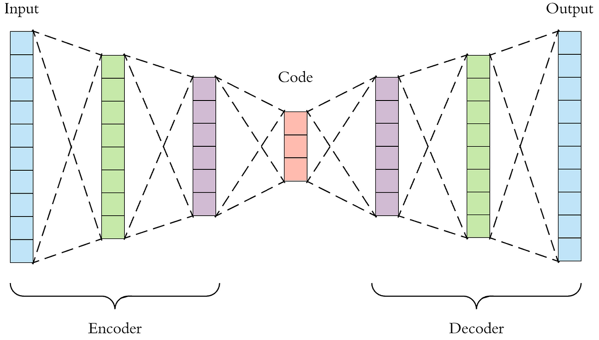

# Unsupervised anomaly detection

A python project to find anomaly in an Xray image.

The aim is detect pneumonia in a thorax radiography and explain AI decision.

## First method : Unsupervised method with autoencoders

We will first use autoencoders. Autoencoders is an encoder-decoder system that reconstructs input as the output.



- Autoencoder will receive image as input, then it will encode this image in a low dimensional representation,

- The second part is decoding, the aim of the encoder is reproduct the original input,

- Then we will compare input and output to classify input image.

### Training

We first feed our autoencoder with normal images.

## Tensorboard

**_Source :_**
[tensorboard-doc](https://www.tensorflow.org/tensorboard/get_started?hl=fr)

### For python notebook

```python
%load_ext tensorboard
%tensorboard --logdir logs/fit
```

## Improvement

I will try to use data augmentation and fine tuned model.
