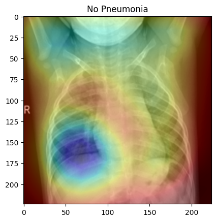
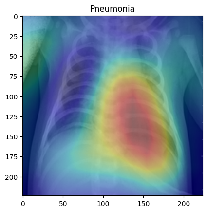

# python AI explainability

A python project to find anomaly in an Xray image.

The aim is detect pneumonia in a thorax radiography and explain AI decision.

**_Training data source :_**
[database link](https://www.kaggle.com/datasets/tolgadincer/labeled-chest-xray-images)

## Model

I use a `VGG16` model.

## M1 use

You need to create a conda environment to increase your training performances :

```bash
source ~/.zshrc
conda create -n tf_m1 python=3.11
conda activate tf_m1
conda install -c apple tensorflow-deps
pip install tensorflow-macos
pip install tensorflow-metal
```

## Training

First create `.env` file :

```bash
mv .env.example .env
```

Then fill `.env` file with your values.

In your conda env :

```bash
python train.py
```

## Training results with test set

```bash
-------------------- Dataset Summary --------------------

Number of train images :  4684


Number of test images :  586


Number of validation images :  586


Shape of each images :  (224, 224, 3)
---------------------------------------------------------

loss: 0.0611 - accuracy: 0.9795
```

## Results




## Tensorboard

**_Source :_**
[tensorboard-doc](https://www.tensorflow.org/tensorboard/get_started?hl=fr)

### For python notebook

```python
%load_ext tensorboard
%tensorboard --logdir logs/fit
```
